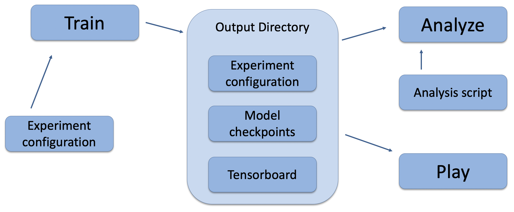

# Admiral

Admiral is a package for developing agent based simulations and training them
with multiagent reinforcement learning. We provide an intuitive command line
interface for training, viewing, and analyzing agent behavior. We support
several environment interfaces, including gym.Env and MultiAgentEnv, and provide
useful wrappers for integrating simulations with the RL stack.

Admiral is a layer in the Reinforcement Learning stack that sits on top of RLlib.
We leverage RLlib's framework for training agents and extend it to more easily
support custom environments, algorithms, and policies. We enable researchers to
rapidly prototype RL experiments and environment design and lower the barrier
for pre-existing projects to prototype RL as a potential solution.

## Design
A reinforcement learning experiment contains two main components: (1) a simulation
environment and (2) learning agents, which contain policies that map observations
to actions. These policies may be hard-coded by the researcher or trained
by the RL algorithm. In Admiral, these two components are specified in a single
Python configuration script. The components can be defined in-script or imported
as modules.

Once these components are setup, they are passed as parameters to RLlib's
tune command, which will launch the RLlib application and begin the training
process. The training process will save checkpoints to an output directory,
from which you can visualize and analyze results. The following diagram
demonstrates this workflow.




## Installation

### Clone the repository
1. Setup your ssh configuration according to [these instructions](https://lc.llnl.gov/confluence/display/GITLAB/GitLab+CI#GitLabCI-cloning)
   * Note: You can only clone using ssh
1. Clone the repository using the clone link above

### Simple Installation
Install from requirements file. This uses tensorflow and installs all you need
to run the examples.
1. Install the requirements: `pip install -r requirements.txt`
1. Install Admiral `pip install .` or `pip install -e .`


### Detailed installation
Install each package as needed.

To train:
1. Install tensorflow or pytorch
1. Install ray rllib v0.8.5: `pip install ray[rllib]==0.8.5`
1. Install Admiral: `pip install .` or `pip install -e .`

To play:
1. Install matplotlib: `pip install matplotlib`

To run Predator-Prey example:
1. Install python-box: `pip install python-box`
1. Install seaborn: `pip install seaborn`


## Usage

We must define a configuration script that specifies the environment and agent
parameters. Once we have this script, we can use the command-line interface
to train, play, and analyze agent behavior. Full examples can be found
[here](examples/).

### Creating a configuration script

```python
""" This example demonstrates training a single agent environment."""

from admiral.envs.flight import Flight_v0 as Flight

env_name = 'Flight-v0'
env_config = {
    'birds': 4,
}
env = Flight.build(env_config)
from ray.tune.registry import register_env
register_env(env_name, lambda env_config: Flight.build(env_config))

algo_name = 'PPO'

params = {
    'experiment': {
        'title': '{}'.format('Flight-single-agent'),
    },
    'ray_tune': {
        'run_or_experiment': algo_name,
        'checkpoint_freq': 50,
        'stop': {
            'episodes_total': 20_000,
        },
        'config': {
            # --- Environment ---
            'env': env_name,
            'env_config': env_config,
            # --- Parallelism ---
            # Number of workers per experiment: int
            "num_workers": 7,
            # Number of environments that each worker starts: int
            "num_envs_per_worker": 4,
        },
    }
}
```

**Warning**: This example has `num_workers` set to 7 because we are on a computer
with 8 CPU's. You may need to adjust this for your computer to be `<cpu count> - 1`.

### Using the command line 

#### Training

With the configuration scipt complete, we can utilize the command line interface
to train our predator. We simply type

```
admiral train flight_training.py
```
where `flight_training.py` is the name of our script. This will launch
Admiral, which will process the script and launch RLlib according to the
specified parameters. This particular example should take about 10 minutes to
train. You can view the performance in real time in tensorboard with
```
tensorboard --logdir ~/admiral_results
```

#### Playing
The birds have made some progress in learning to fly without crashing into each
other or the region boundaries. We can vizualize the birds' learned behavior with
the `play` command, which takes as argument the output directory
from the training session stored in `~/admiral_results`. For example, the command

```
admiral play ~/admiral_results/Flight-single-agent-2020-08-25_09-30/ -n 5 --record
```

will load the training session (notice that the directory name is the experiment
name from the configuration script appended with a timestamp) and display an animation
of 5 episodes. The `--record` flag will save the animations as `.mp4` videos in
the training directory.

#### Analyzing

See the [Predator-Prey example](examples/predator_prey), which provides a great use case
for analyzing agent behaviors.

## Running on LC
See the [lc-magpie example](examples/lc-magpie/), which provides a walkthrough
for launching a training experiment on multiple compute nodes.

## Continued Support

Admiral was funded as an ISCP project through Computing's Idea Day call. What you
see here is a minimal viable product (MVP), with enhancements planned in future
ISCP projects. However, this project is meant to be primarily *community driven*.
If you use Admiral in your workflow, please consider contributing any features
you think would be useful to the greater RL community. In addition, please contact
me or fill out a "new issue" if you encounter any bugs or want features to be
implemented.

## Contact

Edward Rusu, rusu1@llnl.gov
Ruben Glatt, glatt1@llnl.gov

## Release

LLNL-CODE-815883

