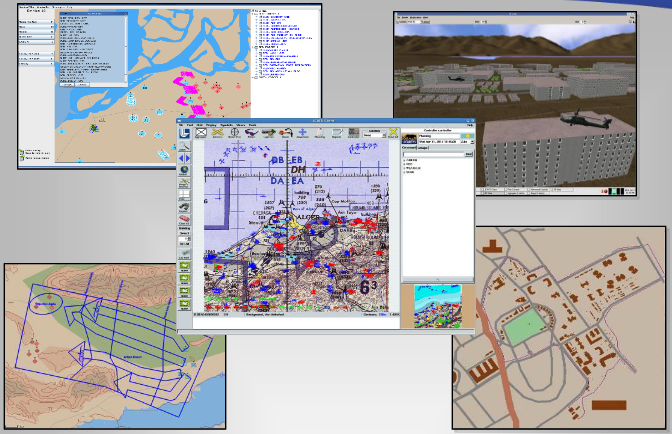
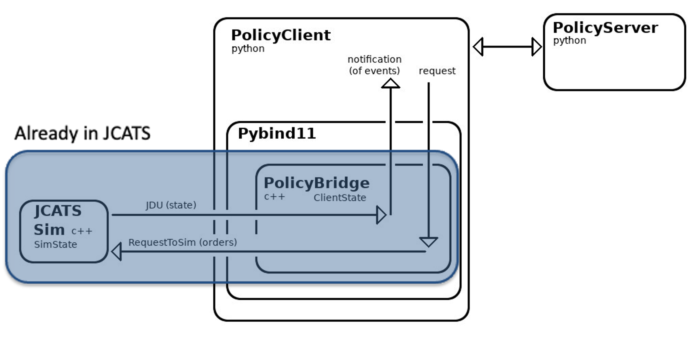
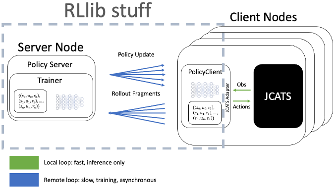
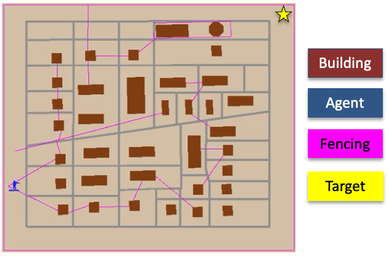
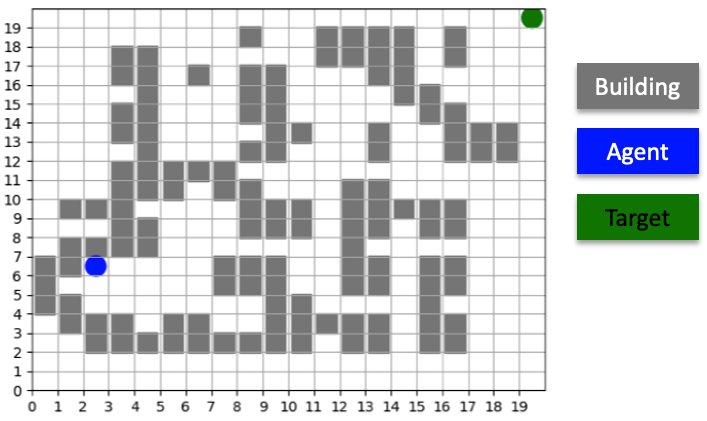
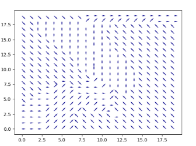
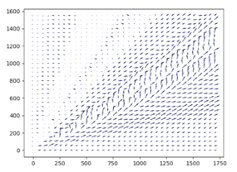
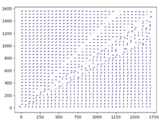

.. Abmarl documentation highlights.


.. _jcats_nav:

AI-Enabled Conflict Simulation
==============================
.. include_after_this_label

We use :ref:`Abmarl's simulation interface <abs>` to connect a C++
based conflict simulation `JCATS <https://computing.llnl.gov/projects/jcats>`_ to
reinforcement learning algorithms in order to
train an agent to navigate to a waypoint. All state updates are controlled by the
JCATS simulation itself. Positional observations are reported to the RL policy, which in turn
issues movement commands to the the simulator. We leveraged Abmarl as a proxy simulation
to rapidly find a warm start configuration. Training is performed on a cluster
of 4 nodes utilizing
`RLlib's client-server architecture <https://docs.ray.io/en/latest/rllib/rllib-env.html#external-application-clients>`_.
We successfully generated 136 million training steps and trained the agent to navigate the scenario.

.. include_before_this_label

JCATS and the PolicyClient Infrastructure
-----------------------------------------

`JCATS <https://computing.llnl.gov/projects/jcats>`_ is the Joint Conflict And
Tactical Simulation developed and maintained
by Lawrence Livermore National Laboratory. It's objective is to simulate real conflict
in real time with real data. It is a discrete-event, agent-based
conflict simulator that can simulate land, air, and sea agents in open scenarios.
The user interacts with the simulation through a GUI, from which we can control
a single agent all the way up to an entire task force.



   User experience in JCATS, including the GUI and 3d renderings.

JCATS supports two modes: (1) *human-interactive* mode and (2) *batch* mode. In the
*interactive* mode, the user interacts with JCATS via a GUI, which provides a graphical
visualization of the state of the simulation. We can pause the simulation, query
static and dynamic properties of agents and terrain to build up observations, and
we can issue actions to the
agents in our control. To support human-interaction, the simulation runs *throttled*:
it is artificially slowed down for the user to keep pace with it. While this mode is great for its purpose, it is too slow
for reinforcement learning application, which requires the simulation to rapidly
generate data.

JCATS *batch* mode requires pre-scripted plan files made up of action sequences. The simulation runs the actions
from those files *unthrottled*, generating huge amounts of data very quickly. The
drawback in batch mode is that we cannot dynamically update the action sequence
mid-game, which is necessary for our reinforcement learning interest.

We wanted the speed of batch mode with the dynamic action control of interactive mode,
so we leveraged JCATS's client-server architecture to create a *PolicyClient*. State
and action functions and variable are exposed to a client object, which is wrapped
with `PyBind11 <https://github.com/pybind/pybind11>`_ to bring the functionality
to Python. The PolicyClient is a general-purpose
interactive interface that can be used to drive JCATS and connect it with other
libraries in Python, including open-source reinforcement learning libraries.



   How the PolicyClient fits into JCATS's client-server architecture.

.. _jcats_rllib_training:

Scaling Training with RLlib
---------------------------

`RLlib <https://docs.ray.io/en/latest/rllib/index.html>`_ is an open-source reinforcement
learning libraries written in python.
It utilizes a
`client-server <https://docs.ray.io/en/latest/rllib/rllib-env.html#external-agents-and-applications>`_
architecture to accomplish reinforcement
learning training at scale on HPC systems. The trainer is the server that receives
data from the clients, which it processes according to the specific reinforcement
learning algorithm to update the policy and send those updated weights to the clients.
Each client node has a local instance of JCATS,
allowing the node to quickly generate rollout fragments locally. As the rollout fragments build up, the client
sends them to the server and receives policy updates asynchronously.



   Scalable training with RLlib's client-server architecture.

We have two dimensions of scalability available to us. First, we can launch multiple
instances of JCATS on a single compute
node. Second, we an have muliptle client nodes, all connected to the same training
server.


.. _jcats_nav_scenario:

JCATS Navigation Scenario
-------------------------

The JCATS Navigation Scenario is set in a continuous spatial domain
and contains a set of buildings
interconnected with fences, among which there are several paths an agent can take
to reach a waypoint. The agent, a single infantry unit, must navigate the 2100x2100
maze by issuing movement commands
in the form of continuous relative vectors (up to 100 units away) while only observing its exact position
and nothing about its surroundings.



   Collection of buildings and fences that make up a maze scenario. The JCATS agent
   must learn to navigate the maze by issuing local movement commands.


Abmarl Simulation Interface
```````````````````````````

We wrap the PolicyClient interface with an Abmarl :ref:`Agent Based Simulation <abs>`
class to connect the JCATS simulation with :ref:`RLlib <jcats_rllib_training>`.
The observation space is
a two-dimensional continuous array of the agent's position, which ranges from ``(0, 0)``
to ``(2100, 2100)``. The action space is a relative movement vector that captures
the agent's movement range, from ``(-100, -100)`` to ``(100, 100)``.

We need to discretize the time steps in order to use JCATS like a discrete-time simulator. We determine
the minimal amount of time needed for the simulation to process moving our agent
100 units away and set this as the discrete *time-gram*. Any time less than this
and the agent would essentially be wasting some of its action space since the simulation
would not process the full state update before requesting another action from the
policy. Thus, in each step, the
policy will issue a movement command, and then the PolicyClient tells the simulation to run for 50 simulation
seconds.


Proxy Simulation with Abmarl's GridWorld Simulation Framework
-------------------------------------------------------------

We leveraged :ref:`Abmarl's GridWorld Simulation Framework <gridworld>` to serve as a proxy
for the :ref:`JCATS navigation scenario <jcats_nav_scenario>`. The corresponding Abmarl scenario is
a 20x20 discrete grid with barriers located in approximately the same locations
as the buildings in the JCATS scenario. The agent issues movement commands in the form of discrete
relative vectors. Abmarl serves as a particularly good proxy because it can generate
data 300x faster than JCATS, enabling us to iterate experiment configuration
to answer questions like:

1. What does the agent need to observe?
2. How does it need to be rewarded?
3. What are good hyperparameters for the learning algorithm?
4. How should we design the neural network?

We can work through learning shots in Abmarl much faster than in JCATS to find a
configuration that we can use as a warm-start for the JCATS training.



   Abmarl proxy scenario, used for finding good training configurations.


Searching for Rewards and Observations
``````````````````````````````````````

The two most pressing questions are (1) how should the agent be rewarded and (2)
what does it need to observe. For the sake of this demonstration, we show three
different configurations:

.. list-table:: Finding viable experiment configurations
   :widths: 25 25 50
   :header-rows: 1

   * - Heading row 1, column 1
     - Training Time
     - Simulation Steps
   * - Regional Awareness
     - 1 minute
     - 132 thousand
   * - Only Position
     - 30 minutes
     - 2.5 million
   * - Position with Soft Reward
     - 2 minutes
     - 300 thousand

Regional Awareness
~~~~~~~~~~~~~~~~~~

In this configuration, the agent can :ref:`observe the surrounding region <gridworld_position_centered_observer>`.
It is rewarded for reaching the waypoint on the other side of the grid and penalized
for making invalid moves (e.g. moving into a barrier). Training this scenario in Abmarl took one
minute and required 132 thousand steps. This is a great configuration, but it is
difficult to implement regional-awareness in JCATS because it requires the ability
for the PolicyClient to provide a local subset of the simulation state.

Only Position
~~~~~~~~~~~~~

In this configuration, the agent can only :ref:`observe its absolute position <gridworld_absolute_position_observer>`. It is rewarded
for reaching the waypoint and penalized for making invalid moves. This configuration
is easy to implement in JCATS because it only requires exposing a single state
variable, namely the agent's absolute position. However, training is difficult because
the policy must learn to map absolute position to movement without any knowledge
of surroundings. Training this scenario in Abmarl took 30 minutes and required 2.5
million steps.


Soft Reward
~~~~~~~~~~~

In this configuration, the agent only :ref:`observes its absolute position <gridworld_absolute_position_observer>`. It is rewarded
for reaching the waypoint, and there are no penalties. This configuration is easy
to implement in JCATS and easy to train. Training this scenario in JCATS took 2
minutes and 300 thousands steps.

A few training runs in the course of less than one hour enabled us to find a good
training configuration for the JCATS training shot, thanks to Abmarl's GridWorld
Simulation Framework.


Decision Field Analysis
```````````````````````

We query our trained policy over all the cells in our grid to produce a direction
field, showing us a visual depiction of the navigation policy. If we imagine the
arrows pointing "down" the gradient, we can see that the policy learns to direct
all movements to the "valley" which is the shortest path to the waypoint.

.. image:: ../.images/jcats_abmarl_maze_solve.*
   :width: 48 %
   :alt: Animation showing the agent navigating to the waypoint.


The direction field serves as an tool for analyzing what a policy learns and how
its performance evolves over time.


Training and Analysis in JCATS
------------------------------

Finally, we take our reward+observation configuration and apply it to JCATS for
training on our HPC systems. We utilize RLlib's client-server architecture to train with 4 client
nodes and one server node, with 64 instances of JCATS on each node for a total
of 256 data collectors. After one hour of training, we see that the policy begins
to move the agent in the correct direction, which is generally to the Northeast.

To push our infrastructure even further, we ran the training scenario for 10 days,
totalling 61,440 core hours, and successfully generating 136 million training steps
without any faults in the duration of training. The direction field shows finer-grained
adjustments to the policy to navigate around specific obstructions along the way.





We see in the video below that the agent has learned to navigate the
maze of buildings and fences to reach the waypoint.

.. figure:: ../.images/jcats_maze_navigation.*
   :width: 70 %
   :alt: Animation showing the agent navigating the maze to the waypoint.

   Agent successfully navigating the JCATS maze to reach the target.
