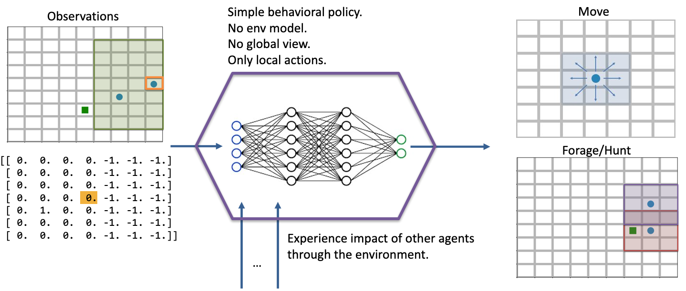

.. Abmarl documentation highlights.


.. _predator_prey:

Emergent Collaborative and Competitive Behavior
===============================================
.. include_after_this_label

In this experiment, we study how collaborative and competitive behaviors emerge
among agents in a partially observable stochastic game. In our simulation, each
agent occupies a square and can move around the map. Each agent can "attack"
agents that are on a different "team"; the attacked agent loses its life and
is removed from the simulation. Each agent can observe the state of the map in
a region surrounding its location. It can see other agents and what team they're
on as well as the edges of the map. The diagram below visuially depicts the agents'
observation and action spaces.

.. include_before_this_label



   Each agent has a partial observation of the map centered around its
   location. The green box shows the orange agent’s observation of the map,
   and the matrix below it shows the actual observation. Each agent can choose
   to move or to "attack" another agent in one of the nearby squares. The policy is just a simple
   2-layer MLP, each layer having 64 units. We don’t apply any kind of specialized
   architecture that encourages collaboration or competition. Each agent is simple: they do not
   have a model of the simulation; they do not have a global view of the simulation; their
   actions are only local in both space and in agent interaction (they can only
   interact with one agent at a time). Yet, we will see efficient and complex
   strategies emerge, collaboration and competition from the common or conflicting
   interest among agents.


In the various examples below, each policy is a two-layer MLP, with 64 units in
each layer. We use RLlib's A2C Trainer with default parameters and train for
two million episodes on a compute node with 72 CPUs.

.. ATTENTION::
   This page makes heavy use of animated graphics. It is best to read this content
   on our html site instead of our pdf manual.

Single Agent Foraging
`````````````````````
We start by considering a single foraging agent whose objective is to move around
the map collecting resource agents. The single forager
can see up to three squares away, move up to one square away, and forage ("attack") resources up
to one square away. The forager is rewarded for every resource it collects and given a small penalty
for attempting to move off the map and an even smaller "entropy" penalty every time-step to
encourage it to act quickly. At the beginning of every episode, the agents spawn
at random locations in the map. Below is a video showing a typical full episode
of the learned behavior and a brief analysis.

.. NOTE::
   From an Agent Based Modeling perspective, the resources are technically agents
   themselves. However, since they don't do or see anything, we tend not to call
   them agents in the text that follows.

.. figure:: ../.images/single_agent_full.*
   :width: 100 %
   :alt: Video showing an episode with the trained behavior.

   A full episode showing the forager's learned strategy. The forager is the blue circle
   and the resources are the green squares. Notice how the forager bounces among
   resource clusters, greedily collecting all local resources before exploring the map for
   more.

When it can see resources
'''''''''''''''''''''''''
The forager moves toward the closest resource that it observes and collects it. Note
that the foraging range is 1 square: the forager rarely
waits until it is directly over a resource; it usually forages
as soon as it is within range. In some cases, the forager intelligently places itself
in the middle of 2-3 resources in order to forage within the least number of moves.
When the resources are near the edge of the map, it behaves with some inefficiency,
likely due to the small penalty we give it for moving off the map, which results
in an aversion towards the map edges. Below is a series of short video
clips showing the foraging strategy.

.. figure:: ../.images/single_agent_exploit.*
   :width: 100 %
   :alt: Video showing the forager's behavior when it observes resources.

   The forager learns an effective foraging strategy, moving towards and collecting
   the nearest resources that it observes.

When it cannot see resources
'''''''''''''''''''''''''''''
The forager's behavior when it is near resources is not surprising. But how does
it behave when it cannot see any resources? The forager only sees that
which is near it and does not have any information distinguishing one "deserted"
area of the map from another. Recall, however, that it observes the edges
of the map, and it uses this information to learn an effecive exploration strategy.
In the video below, we can see that the forager learns to explore the map by moving
along its edges in a clockwise direction, occasionally making random moves towards
the middle of the map.

.. figure:: ../.images/single_agent_explore.*
   :width: 100 %
   :alt: Video showing the forager's behavior when it does not observe resources.

   The forager learns an effective exploration strategy, moving along the edge
   of the map in a clockwise direction.

.. IMPORTANT::
   We do not use any kind of heuristic or mixed policy. The exporation strategy
   *emerges* entirely from reinforcement learning.

Multiple Agents Foraging
````````````````````````
Having experimented with a single forager, let us now turn our attention
to the strategies learned by multiple foragers interacting in the map at the same
time. Each forager is homogeneous with each other as described above: they can
all move up to one square away, observe up to three squares away, and are rewarded
the same way. The observations include other foragers in addition to the resources
and map edges. All agents share a single policy. Below is a brief analysis of the
learned behaviors.

Cover and explore
'''''''''''''''''
Our reward schema implicitly encourages the foragers to collaborate because we give
a small penalty to each one for taking too long. Thus, the faster they
can collect all the resources, the less they are penalized. Furthermore, because each
agent trains the same policy, there is no incentive for competitive behavior. An
agent can afford to say, "I don't need to get the resource first. As long as one
of us gets it quickly, then we all benefit". Therefore, the foragers learn to spread
out to *cover* the map, maximizing the amount of squares that are observed. 

In the video clips below, we see that the foragers avoid being within observation
distance of one another. Typically, when two foragers get too close, they repel
each other, each moving in opposite directions, ensuring that the space is *covered*.
Furthermore, notice the dance-like exploration strategy.
Similar to the single-agent case above, they learn to *explore* along the
edges of the map in a clockwise direction. However, they're not as efficient as
the single agent because they "repel" each other.

.. figure:: ../.images/multi_agent_spread.*
   :width: 100 %
   :alt: Video showing how the foragers spread out.

   The foragers cover the map by spreading out and explore it by traveling in a
   clockwise direction.

.. IMPORTANT::
   We do not directly incentivize agents to keep their distance. No part of the
   reward schema directly deals with the agents' distances from each other. These
   strategies are *emergent*.

Breaking the pattern
''''''''''''''''''''
When a forager observes a resource, it breaks its "cover and explore" strategy and
moves directly for the resource. Even multiple foragers move towards the same resource.
They have no reason to coordinate who will get it because, as we stated above,
there is no incentive for competition, so no need to negotiate. If another forager
gets there first, everyone benefits. The foragers learn to prioritize collecting
the resources over keeping their distance from each other.

.. figure:: ../.images/multi_agent_forage.*
   :width: 100 %
   :alt: Video showing how the foragers move towards resources.

   The foragers move towards resources to forage, even when there are other foragers
   nearby.

.. Tip::
   We should expect to see both of these strategies occuring at
   the same time within a simulation because while some agents are "covering and
   exploring", others are moving towards resources.

Introducing Hunters
```````````````````
So far, we have seen intelligent behaviors emerge in both single- and multi-forager
scenarios; we even saw the emergence of collaborative
behavior. In the following experiments, we explore competitive emergence by introducing
hunters into the simulation. Like foragers, hunters can move up to one square away
and observe other agents and map edges up to three squares away. Hunters, however,
are more effective killers and can attack a forager up to two squares away. They are
rewarded for successful kills, they are and penalized for bad moves and for taking
too long, exactly the same way as foragers.

However, the hunters and foragers have completely different objectives:
a forager tries to clear the map of all *resources*, but a hunter tries to clear
the map of all *foragers*. Therefore, we set up two policies. All the hunters
will train the same policy, and all the foragers will train the same policy, and
these policies will be distinct. 

The learned behaviors among the two groups in this mixed collaborate-competitive
simulation are tightly integrated, with multiple strategies appearing at the same
time within a simulation. Therefore, in contrast to above, we will not show video
clips that capture a single strategy; instead, we will show video clips that
capture multiple strategies and attempt to describe them in detail.

First Scenario
''''''''''''''

.. image:: ../.images/teams_scenario_1.*
   :width: 100 %
   :alt: Video showing the first scenario with hunters and foragers.

Two of the foragers spawn next to hunters and are killed immediately. Afterwards,
the two hunters on the left do not observe any foragers for some time. They seem to have
learned the *cover* strategy by spreading out, but they don't seem to have
learned an effecient *explore* strategy since they mostly occupy the same region
of the map for the duration of the simulation.

Three foragers remain at the bottom of the map. These foragers
work together to collect all nearby resources. Just as they finish the resource cluster,
a hunter moves within range and begins to chase them towards the bottom of the
map. When they hit the edge, they split in two directions. The hunter kills
one of them and then waits for one step, unsure about which forager to persue next.
After one step, we see that it decides to persue the forager to the right.

Meanwhile, the forager to the left continues to run away, straight into the path
of another hunter but also another resource. The forager could get away by running
to the right, but it decides to collect the resource at the cost of its own life.

The last remaining forager has escaped the hunter and has conveniently found another
cluster of resources, which it collects. A few frames later, it encounters the
same hunter, and this time it is chased all the way across the map. It manages
to evade the hunter and collect one final resource before encountering yet another
hunter. At the end, we see both hunters chasing the forager to the top of the map,
boxing it in and killing it.

Second scenario
'''''''''''''''

.. image:: ../.images/teams_scenario_2.*
   :width: 100 %
   :alt: Video showing the second scenario with hunters and foragers.

None of the foragers are under threat at the beginning of this scenario. They clear
a cluster of resources before one of them wanders into the path of a hunter. The
hunter gives chase, and the forager actually leads the hunter back to the group.
This works to its benefit, however, as the hunter is repeatedly confused by the
foragers exercising the *splitting* strategy. Meanwhile the second hunter has spotted
a forager and joins the hunt. The two hunters together are able to split up the pack
of foragers and systematically hunt them down. The last forager is chased into the
corner and killed.

.. NOTE::
   Humorously, the first forager that was spotted is the one who manages to stay
   alive the longest.
