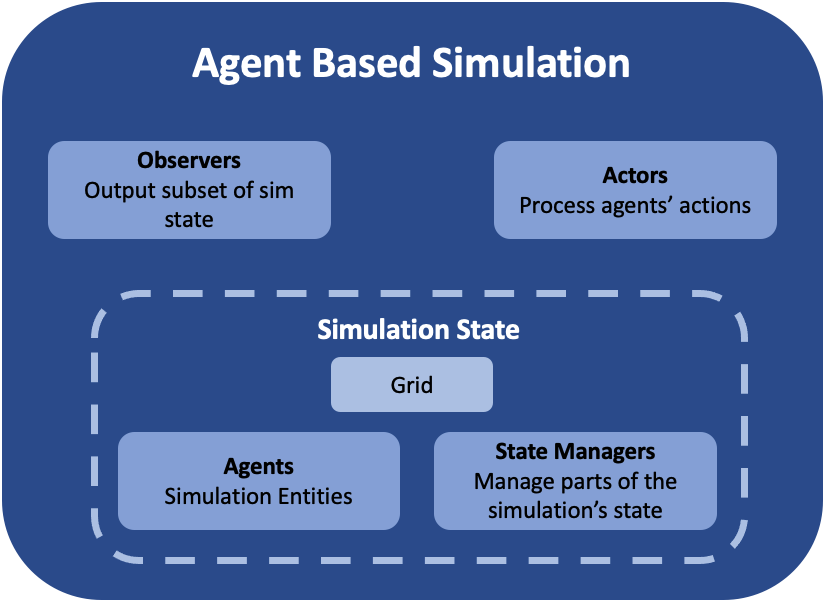
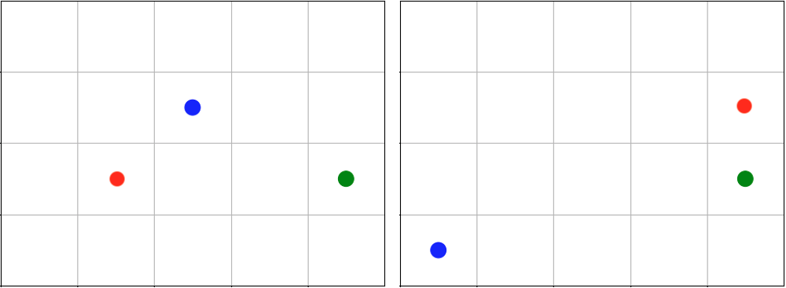
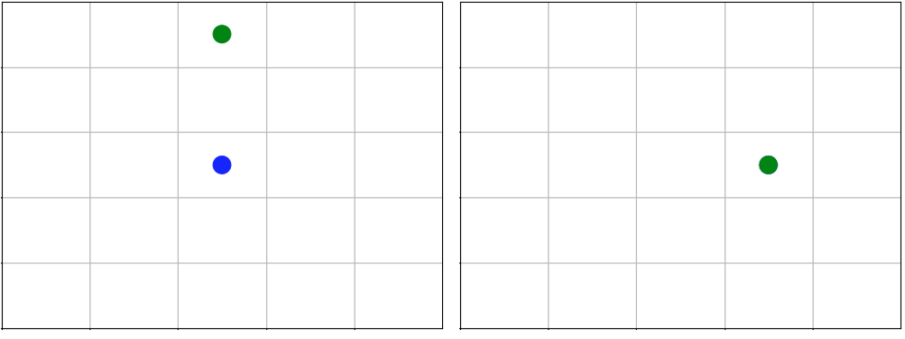
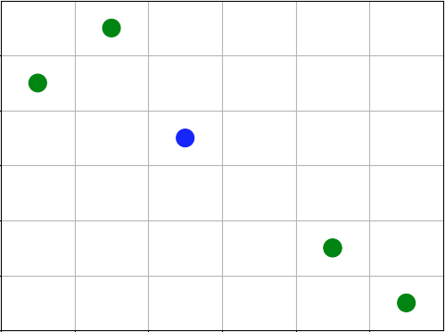
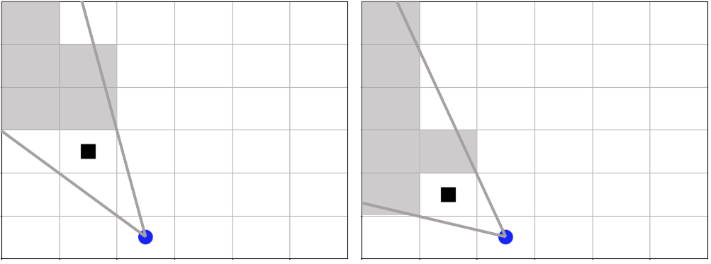
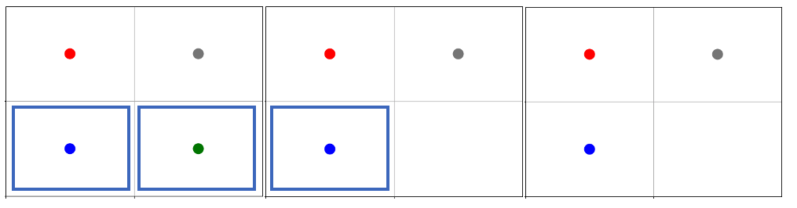
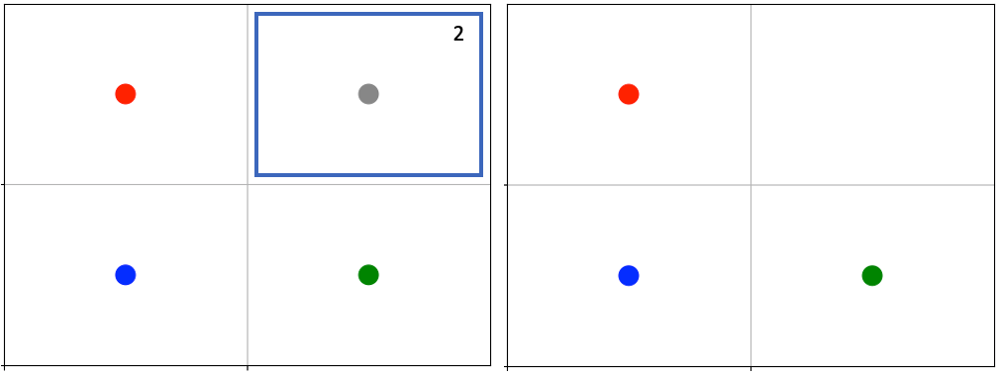
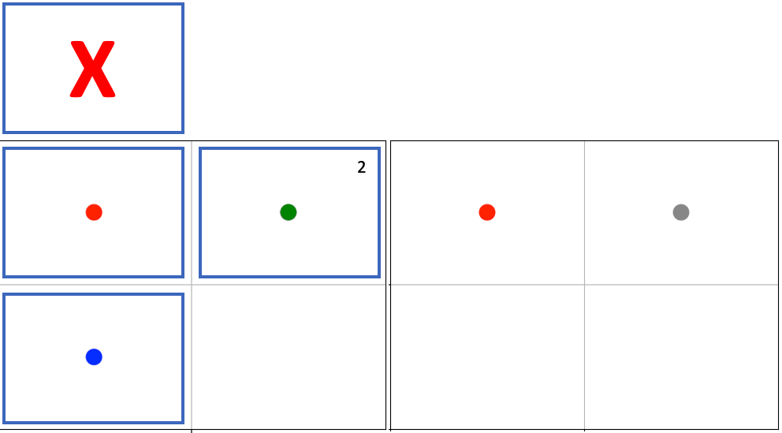
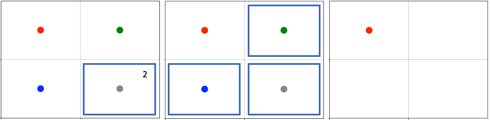

.. Abmarl gridworld documentation

.. _gridworld:

GridWorld Simulation Framework
==============================

Abmarl provides a GridWorld Simulation Framework for setting up grid-based
Agent Based Simulations, which can be connected to Reinforcement Learning algorithms
through Abmarl's :ref:`AgentBasedSimulation <abs>` interface. The GridWorld
Simulation Framework is a `grey box`: we assume users have working knowledge of 
Python and object-oriented programming. Using the
:ref:`built in features <gridworld_built_in_features>` requires minimal knowledge,
but extending them and creating new features requires more knowledge.
In addition to the design documentation below, see the :ref:`GridWorld tutorials <tutorials_gridworld>`
for in-depth examples on using and extending the GridWorld Simulation Framework.


Framework Design
----------------



   Abmarl's GridWorld Simulation Framework. A simulation has a Grid, a dictionary
   of agents, and various components that manage the various features of the simulation.
   The componets shown in medium-blue are user-configurable and -creatable.

The GridWorld Simulation Framework utilizes a modular design that allows users
to create new features and plug them in as components of the simulation. Every component
inherits from the :ref:`GridWorldBaseComponent <api_gridworld_base>` class and has a reference to
a :ref:`Grid <gridworld_grid>` and a dictionary of :ref:`Agents <gridworld_agent>`.
These components make up a :ref:`GridWorldSimulation <api_gridworld_sim>`, which extends the
:ref:`AgentBasedSimulation <abs>` interface. For example, a simulation might look
something like this:

.. code-block:: python

   from abmarl.sim.gridworld.base import GridWorldSimulation
   from abmarl.sim.gridworld.state import PositionState
   from abmarl.sim.gridworld.actor import MoveActor
   from abmarl.sim.gridworld.observer import SingleGridObserver
   
   class MyGridSim(GridWorldSimulation):
       def __init__(self, **kwargs):
           self.agents = kwargs['agents']
           self.position_state = PositionState(**kwargs)
           self.move_actor = MoveActor(**kwargs)
           self.observer = SingleGridObserver(**kwargs)

       def reset(self, **kwargs):
           self.position_state.reset(**kwargs)
       
       def step(self, action_dict):
           for agent_id, action in action_dict.items():
               self.move_actor.process_action(self.agents[agent_id], action)
    
       def get_obs(self, agent_id, **kwargs):
           return self.observer.get_obs(self.agents[agent_id])
       ...

.. _gridworld_agent:

Agent
`````

Every entity in the simulation is a :ref:`GridWorldAgent <api_gridworld_agent>`
(e.g. walls, foragers, resources, fighters, etc.). GridWorldAgents are :ref:`PrincipleAgents <api_principle_agent>` with specific parameters
that work with their respective components. Agents must be given
an `encoding`, which is a positive integer that correlates to the type of agent and simplifies
the logic for many components of the framework. GridWorldAgents can also be configured
with an :ref:`initial position <gridworld_position>`, the ability to
:ref:`block <gridworld_blocking>` other agents' abilities, and visualization
parameters such as `shape` and `color`.

Following the dataclass model, additional agent classes can be defined that allow
them to work with various components. For example, :ref:`GridObservingAgents <gridworld_single_observer>` can work with
:ref:`Observers <gridworld_single_observer>`, and :ref:`MovingAgents <gridworld_movement>` can work with the :ref:`MoveActor <gridworld_movement>`. Any new agent class should
inhert from :ref:`GridWorldAgent <api_gridworld_agent>` and possibly from :ref:`ActingAgent <api_acting_agent>` or :ref:`ObservingAgent <api_observing_agent>` as needed.
For example, one can define a new type of agent like so:

.. code-block:: python

   from abmarl.sim.gridworld.agent import GridWorldAgent
   from abmarl.sim import ActingAgent

   class CommunicatingAgent(GridWorldAgent, ActingAgent):
       def __init__(self, broadcast_range=None, **kwargs):
           super().__init__(**kwargs)
           self.broadcast_range = broadcast_range
           ...

.. WARNING::
   Agents should follow the dataclass model, meaning that they should only be given
   parameters. All functionality should be written in the simulation components.


.. _gridworld_grid:

Grid
````
The :ref:`Grid <api_gridworld_grid>` stores :ref:`Agents <gridworld_agent>` in a two-dimensional numpy array. The Grid is configured
to be a certain size (rows and columns) and to allow types of Agents to overlap
(occupy the same cell). For example, you may want a ForagingAgent to be able to overlap
with a ResourceAgent but not a WallAgent. The `overlapping` parameter
is a dictionary that maps the Agent's `encoding` to a set of other Agents' `encodings`
with which it can overlap. For example,

.. code-block:: python

   from abmarl.sim.gridworld.grid import Grid

   overlapping = {
       1: {2},
       2: {1, 3},
       3: {2, 3}
   }
   grid = Grid(5, 6, overlapping=overlapping)

means that agents whose `encoding` is 1 can overlap with other agents whose `encoding`
is 2; agents whose `encoding` is 2 can overlap with other agents whose `encoding` is
1 or 3; and agents whose `encoding` is 3 can overlap with other agents whose `encoding`
is 2 or 3.

.. NOTE::
   If `overlapping` is not specified, then no agents will be able to occupy the same
   cell in the Grid.

Interaction between simulation components and the :ref:`Grid <api_gridworld_grid>` is
`data open`, which means that we allow components to access the internals of the
Grid. Although this is possible and sometimes necessary, the Grid also provides
an interface for safer interactions with components. Components can `query` the
Grid to see if an agent can be placed at a specific position. Components can `place`
agents at a specific position in the Grid, which will succeed if that cell is available
to the agent as per the `overlapping` configuration. And Components can `remove`
agents from specific positions in the Grid. 


.. _gridworld_state:

State
`````

:ref:`State Components <api_gridworld_statebase>` manage the state of the simulation alongside the :ref:`Grid <gridworld_grid>`.
At the bare minimum, each State resets the part of the simulation that it manages
at the the start of each episode.


.. _gridworld_actor:

Actor
`````

:ref:`Actor Components <api_gridworld_actor>` are responsible for processing agent actions and producing changes
to the state of the simulation. Actors assign supported agents with an appropriate
action space and process agents' actions based on the Actor's key. The result of
the action is a change in the simulation's state, and Actors should return that
change in a reasonable form. For example, the :ref:`MoveActor <gridworld_movement>` appends :ref:`MovingAgents' <gridworld_movement>` action
spaces with a 'move' channel and looks for the 'move' key in the agent's incoming
action. After a move is processed, the MoveActor returns if the move was successful.


.. _gridworld_observer:

Observer
````````

:ref:`Observer Components <api_gridworld_observer>` are responsible for creating an
agent's observation of the state of the simulation. Observers assign supported agents
with an appropriate observation space and generate observations based on the
Observer's key. For example, the :ref:`SingleGridObserver <gridworld_single_observer>`
generates an observation of the nearby grid and stores it in the 'grid' channel of
the :ref:`ObservingAgent's <gridworld_single_observer>` observation.


.. _gridworld_done:

Done
````

:ref:`Done Components <api_gridworld_done>` manage the "done state" of each agent and of the simulation as a
whole. Agents that are reported as done will cease sending actions to the simulation, 
and the episode will end when all the agents are done or when the simulation is done.


.. _gridworld_wrappers:

Component Wrappers
``````````````````

The GridWorld Simulation Framework also supports
:ref:`Component Wrappers <api_gridworld_wrappers>`. Wrapping a component
can be useful when you don't want to add a completely new component and
only need to make a modification to the way a component already works. A component
wrapper is itself a component, and so it must implement the same interface as the
wrapped component to ensure that it works within the framework. A component wrapper
also defines additional functions for wrapping spaces and data to and from those
spaces: ``check_space`` for ensuring the space can be transformed, ``wrap_space`` to
perform the transformation, ``wrap_point`` to map data to the transformed space,
and ``unwrap_point`` to map transformed data back to the original space.

As its name suggests, a :ref:`Component Wrapper <api_gridworld_wrappers>` stands
between the underlying component and other
objects with which it exchanges data. As such, a wrapper typically modifies
the incoming/outgoing data before leveraging the underlying component for
the actual datda processing. The main difference among wrapper types is in
the direction of data flow, which we detail below.

Actor Wrappers
~~~~~~~~~~~~~~

:ref:`Actor Wrappers <api_gridworld_actor_wrappers>` receive actions in the
`wrapped_space` through the ``process_action``
function. It can modify the data before sending it to the underlying Actor to
process. An Actor Wrapper may need to modify the action spaces of corresponding agents
to ensure that the action arrives in the correct format. 


.. _gridworld_building:

Building the Simulation
```````````````````````

The :ref:`GridWorldSimluation <api_gridworld_sim>` supports various methods of building
a defined simulation.

Build Sim
~~~~~~~~~

Users can build a simulation by supplying the number of rows, columns, and a dictionary
of agents. The grid is initialized to the specified size and populated using information
contained in the agents dictionary in conjunction with the simulation's state handlers.
For example, the following simulation is built using information just from the dictionary
of agents:

.. code-block:: python

   from abmarl.sim.gridworld.agent import GridWorldAgent

   class MultiAgentGridSim(GridWorldSimulation):
       def __init__(self, **kwargs):
           self.agents = kwargs['agents']
           self.grid = kwargs['grid']
   
           self.position_state = PositionState(**kwargs)
   
           self.finalize()

   agent = GridWorldAgent(id='agent0', encoding=1, initial_position=np.array([0, 0]))
   sim = MultiAgentGridSim.build_sim(
       3, 4,
       agents={'agent0': agent}
   )
   sim.reset()

This simulation has a grid of size ``(3 x 4)`` with a single agent with encoding
1 placed at position ``(0, 0)``.

Build Sim From Grid
~~~~~~~~~~~~~~~~~~~

Users can build a simulation by copying from an existing :ref:`grid <gridworld_grid>`.
The builder will use the state of the grid as the initial state for the new grid
for the simulation. Particularly, agents will be assigned initial positions based
on their positions within the input grid. Extra agents can be included in the
simulation via the ``extra_agents`` argument. For example, the following simulation
is built using a pre-defined grid and extra agents:

.. code-block:: python
   from abmarl.sim.gridworld.agent import GridWorldAgent

   class MultiAgentGridSim(GridWorldSimulation):
       def __init__(self, **kwargs):
           self.agents = kwargs['agents']
           self.grid = kwargs['grid']
   
           self.position_state = PositionState(**kwargs)
   
           self.finalize()

   grid = Grid(2, 2)
   grid.reset()
   agents = {
       'agent0': GridWorldAgent(id='agent0', encoding=1, initial_position=np.array([0, 0])),
       'agent1': GridWorldAgent(id='agent1', encoding=1, initial_position=np.array([0, 1])),
       'agent2': GridWorldAgent(id='agent2', encoding=1, initial_position=np.array([1, 0])),
   }
   grid.place(agents['agent0'], (0, 0))
   grid.place(agents['agent1'], (0, 1))
   grid.place(agents['agent2'], (1, 0))

   extra_agents = {
       'agent0': GridWorldAgent(id='agent0', encoding=2, initial_position=np.array([0, 1])),
       'agent3': GridWorldAgent(id='agent3', encoding=3, initial_position=np.array([0, 1])),
       'agent4': GridWorldAgent(id='agent4', encoding=4, initial_position=np.array([1, 0])),
       'agent5': GridWorldAgent(id='agent5', encoding=5),
   }

   sim = MultiAgentGridSim.build_sim_from_grid(
       grid,
       extra_agents=extra_agents,
       overlapping={1: {3, 4}, 3: {1}, 4: {1}}
   )
   sim.reset()

This simulation has a grid of size ``(2 x 2)``. Agents 0-2 are positioned in the
new grid according to their configuration in the original grid. Agents 3-5 are provided
as extra agents, not from the original grid. Agent0 appears as both an extra agent
and an agent in the original grid. If this happens, the builder prioritizes using
the agent as it exist in the original grid.

.. NOTE::
   For consistency, the agents from the input grid should have their position in
   the grid as their ``initial_position``.

.. CAUTION::
   The agents from the input grid are shallow-copied.


.. _gridworld_built_in_features:

Built-in Features
-----------------

Below is a list of some features that are available to use out of the box. Rememeber,
you can create your own features in
the GridWorld Simulation Framework and use many combinations of components together
to make up a simulation.


.. _gridworld_position:

Position
````````

:ref:`Agents <gridworld_agent>` have `positions` in the :ref:`Grid <gridworld_grid>` that are managed by the
:ref:`PositionState <api_gridworld_state_position>`. Agents
can be configured with an `initial position`, which is where they will start at the
beginning of each episode. If they are not given an `initial position`, then they
will start at a random cell in the grid. Agents can overlap according to the
:ref:`Grid's <gridworld_grid>` `overlapping` configuration. For example, consider the following setup:

.. code-block:: python

   import numpy as np
   from abmarl.sim.gridworld.agent import GridWorldAgent
   from abmarl.sim.gridworld.grid import Grid
   from abmarl.sim.gridworld.state import PositionState

   agent0 = GridWorldAgent(
       id='agent0',
       encoding=1,
       initial_position=np.array([2, 4])
   )
   agent1 = GridWorldAgent(
       id='agent1',
       encoding=1
   )
   position_state = PositionState(
       agents={'agent0': agent0, 'agent1': agent1},
       grid=Grid(4, 5)
   )
   position_state.reset()

`agent0` is configured with an `initial position` and `agent1` is not. At the
start of each episode, `agent0` will be placed at (2, 4) and `agent1` will be placed
anywhere in the grid (except for (2,4) because they cannot overlap).



   agent0 in green starts at the same cell in every episode, and agent1 in blue
   starts at a random cell each time.


.. _gridworld_movement:

Movement
````````

:ref:`MovingAgents <api_gridworld_agent_moving>` can move around the
:ref:`Grid <gridworld_grid>` in conjunction with the
:ref:`MoveActor <api_gridworld_actor_move>`. MovingAgents require a `move range`
parameter, indicating how many spaces away they can move in a single step. Agents
cannot move out of bounds and can only move to the same cell as another agent if
they are allowed to overlap. For example, in this setup

.. code-block:: python

   import numpy as np
   from abmarl.sim.gridworld.agent import MovingAgent
   from abmarl.sim.gridworld.grid import Grid
   from abmarl.sim.gridworld.state import PositionState
   from abmarl.sim.gridworld.actor import MoveActor

   agents = {
       'agent0': MovingAgent(
           id='agent0', encoding=1, move_range=1, initial_position=np.array([2, 2])
       ),
       'agent1': MovingAgent(
           id='agent1', encoding=1, move_range=2, initial_position=np.array([0, 2])
       )
   }
   grid = Grid(5, 5, overlapping={1: {1}})
   position_state = PositionState(agents=agents, grid=grid)
   move_actor = MoveActor(agents=agents, grid=grid)

   position_state.reset()
   move_actor.process_action(agents['agent0'], {'move': np.array([0, 1])})
   move_actor.process_action(agents['agent1'], {'move': np.array([2, 1])})

`agent0` starts at position (2, 2) and can move up to one cell away. `agent1`
starts at (0, 2) and can move up to two cells away. The two agents can overlap
each other, so when the move actor processes their actions, both agents will be
at position (2, 3).



   agent0 and agent1 move to the same cell.

The :ref:`MoveActor <api_gridworld_actor_move>` automatically assigns a `null action`
of `[0, 0]`, indicating no move.


Cross Move Actor
````````````````

The :ref:`CrossMoveActor <api_gridworld_actor_cross_move>` is very similar to the
:ref:`MoveActor <gridworld_movement>`. Rather than moving to all nearby squares
based on some ``move_range``, :ref:`MovingAgents <api_gridworld_agent_moving>`
can move either up, down, left, right, or stay in place. The ``move_range`` parameter
is ignored. The CrossMoveActor automatically assigns a `null_action` of 0, indicating
the agent stays in place.


.. _gridworld_absolute_position_observer:

Absolute Position Observer
``````````````````````````

The :ref:`AbsolutePositionObserver <api_gridworld_observer_absolute>` enables
:ref:`ObservingAgents <api_observing_agent>` to observe their own absolute position
in the grid. The position is reported as a two-dimensional numpy array, whose lower
bounds are ``(0, 0)`` and upper bounds are the size of the grid minus one. This
observer does not provide information on any other agent in the grid.


.. _gridworld_absolute_grid_observer:

Absolute Grid Observer
``````````````````````

:ref:`AbsoluteGridObserver <api_gridworld_observer_absolute_grid>` means that the
:ref:`GridObservingAgent <api_gridworld_agent_observing>` observes the grid
as though it were looking at it from the top down, from the grid's perspective,
so to speak. As agents move around, the grid stays fixed and the observation shows
each agent in their respective cells. Agents are represented by their `encodings`,
and in order for the observing agent to distinguish itself from other entities of
its same `encoding`, it sees itself as a -1.

An agent's observation may be restricted by its own ``view_range`` and by other
agents' :ref:`blocking <gridworld_blocking>`. This imposes a "fog of war" type masking
on the observations. Cells that are not observable will be represented as a -2.
For example, the following setup

.. code-block:: python

   import numpy as np
   from abmarl.sim.gridworld.agent import GridObservingAgent, GridWorldAgent
   from abmarl.sim.gridworld.grid import Grid
   from abmarl.sim.gridworld.state import PositionState
   from abmarl.sim.gridworld.observer import AbsoluteGridObserver

   agents = {
       'agent0': GridObservingAgent(id='agent0', encoding=1, initial_position=np.array([2, 2]), view_range=2),
       'agent1': GridWorldAgent(id='agent1', encoding=2, initial_position=np.array([0, 1])),
       'agent2': GridWorldAgent(id='agent2', encoding=3, initial_position=np.array([1, 0])),
       'agent3': GridWorldAgent(id='agent3', encoding=4, initial_position=np.array([4, 4])),
       'agent4': GridWorldAgent(id='agent4', encoding=5, initial_position=np.array([4, 4])),
       'agent5': GridWorldAgent(id='agent5', encoding=6, initial_position=np.array([5, 5]))
   }
   grid = Grid(6, 6, overlapping={4: {5}, 5: {4}})
   position_state = PositionState(agents=agents, grid=grid)
   observer = AbsoluteGridObserver(agents=agents, grid=grid)

   position_state.reset()
   observer.get_obs(agents['agent0'])

will position agents as below and output an observation for `agent0` (blue) like so:



.. code-block::

   [ 0,  2,  0,  0,  0, -2],
   [ 3,  0,  0,  0,  0, -2],
   [ 0,  0, -1,  0,  0, -2],
   [ 0,  0,  0,  0,  0, -2],
   [ 0,  0,  0,  0, 3*, -2],
   [-2, -2, -2, -2, -2, -2],

This is a ``6 x 6`` grid, so the observation is the same size. The observing agent
is located at ``(2, 2)`` in the grid, just as its position indicates. Other agents appear
in the grid represented as their encodings and located in their positions. Because
the observing agent only has a ``view_range`` of 2, it cannot see the last row or
column, so the observation masks those cells with the value of -2. There are two
agents at position ``(4, 4)``, one with encoding 3 and another with encoding 4. The
:ref:`AbsoluteGridObserver <api_gridworld_observer_absolute_grid>` randomly chooses
from among those encodings.

The :ref:`AbsoluteGridObserver <api_gridworld_observer_absolute_grid>` automatically
assigns a `null observation` as a matrix of all -2s, indicating that everything
is masked.


.. _gridworld_single_observer:

Single Grid Observer
````````````````````

:ref:`GridObservingAgents <api_gridworld_agent_observing>` can observe the state
of the :ref:`Grid <gridworld_grid>` around them, namely which other agents are nearby,
via the :ref:`SingleGridObserver <api_gridworld_observer_single>`. The SingleGridObserver
generates a two-dimensional matrix sized by the agent's `view range` with the observing
agent located at the center of the matrix. While the
:ref:`AbsoluteGridObserver <gridworld_absolute_grid_observer>` observes from the
`grid`'s perspective, the SingleGridObserver observes from the `agent`'s perspective.
All other agents within the `view range` will appear in the observation, shown as
their `encoding`. For example, using the above setup with a ``view_range`` of 3
will output an observation for `agent0` (blue) like so:


.. code-block::

   [-1, -1, -1, -1, -1, -1, -1],
   [-1,  0,  2,  0,  0,  0,  0],
   [-1,  3,  0,  0,  0,  0,  0],
   [-1,  0,  0,  1,  0,  0,  0],
   [-1,  0,  0,  0,  0,  0,  0],
   [-1,  0,  0,  0,  0, 4*,  0],
   [-1,  0,  0,  0,  0,  0,  6]

Since `view range` is the number of cells away that can be observed, the observation size is
``(2 * view_range + 1) x (2 * view_range + 1)``. `agent0` is centered in the middle
of this array, shown by its `encoding`: 1. All other agents appear in the observation
relative to `agent0's` position and shown by their `encodings`. The agent observes some out
of bounds cells, which appear as -1s. `agent3` and `agent4` occupy the same cell,
and the :ref:`SingleGridObserver <api_gridworld_observer_single>` will randomly
select between their `encodings` for the observation.

By setting `observe_self` to False, the :ref:`SingleGridObserver <api_gridworld_observer_single>`
can be configured so that an agent doesn't observe itself and only observes
other agents, which may be helpful if overlapping is an important part of the simulation.

The :ref:`SingleGridObserver <api_gridworld_observer_single>` automatically assigns
a `null observation` as a view matrix of all -2s, indicating that everything is
masked.


Multi Grid Observer
```````````````````

Similar to the :ref:`SingleGridObserver <api_gridworld_observer_single>`,
the :ref:`MultiGridObserver <api_gridworld_observer_multi>` observes the grid from
the observing agent's perspective. It displays a separate matrix for every `encoding`.
Each matrix shows the relative positions of the agents and the number of those agents
that occupy each cell. Out of bounds indicators (-1) and masked cells (-2) are present
in every matrix. For example, the above setup would show an observation like so:


.. code-block::

   # Encoding 1
   [-1, -1, -1, -1, -1, -1, -1],
   [-1,  0,  0,  0,  0,  0,  0],
   [-1,  0,  0,  0,  0,  0,  0],
   [-1,  0,  0,  1,  0,  0,  0],
   [-1,  0,  0,  0,  0,  0,  0],
   [-1,  0,  0,  0,  0,  0,  0],
   [-1,  0,  0,  0,  0,  0,  0]

   # Encoding 2
   [-1, -1, -1, -1, -1, -1, -1],
   [-1,  0,  1,  0,  0,  0,  0],
   [-1,  0,  0,  0,  0,  0,  0],
   [-1,  0,  0,  0,  0,  0,  0],
   [-1,  0,  0,  0,  0,  0,  0],
   [-1,  0,  0,  0,  0,  0,  0],
   [-1,  0,  0,  0,  0,  0,  0]
   ...

:ref:`MultiGridObserver <api_gridworld_observer_multi>` may be preferable to
:ref:`SingleGridObserver <api_gridworld_observer_single>` in simulations where
there are many overlapping agents.

The :ref:`MultiGridObserver <api_gridworld_observer_multi>` automatically assigns
a `null observation` of a tensor of all -2s, indicating that everything is masked.


.. _gridworld_blocking:

Blocking
~~~~~~~~

Agents can block other agents' abilities and characteristics, such as blocking
them from view, which masks out parts of the observation. For example,
if `agent4` above is configured with ``blocking=True``, then the
:ref:`SingleGridObserver <gridworld_single_observer>` would produce an observation
like this:

.. code-block::

   [-1, -1, -1, -1, -1, -1, -1],
   [-1,  0,  2,  0,  0,  0,  0],
   [-1,  3,  0,  0,  0,  0,  0],
   [-1,  0,  0,  1,  0,  0,  0],
   [-1,  0,  0,  0,  0,  0,  0],
   [-1,  0,  0,  0,  0, 4*,  0],
   [-1,  0,  0,  0,  0,  0, -2]

The -2 indicates that the cell is masked, and the choice of displaying `agent3`
over `agent4` is still a random choice. Which cells get masked by blocking
agents is determined by drawing two lines from the center of the observing agent's
cell to the corners of the blocking agent's cell. Any cell whose center falls between
those two lines will be masked, as shown below.



   The black agent is a wall agent that masks part of the grid from the blue agent.
   Cells whose centers fall betweent the lines are masked. Centers that fall directly
   on the line or outside of the lines are not masked. Two setups are shown to 
   demonstrate how the masking may change based on the agents' positions.

Blocking works with any of the built-in grid observers.


Health
``````

:ref:`HealthAgents <api_gridworld_agent_health>` track their `health` throughout the simulation. `Health` is always bounded
between 0 and 1. Agents whose `health` falls to 0 are marked as `inactive`. They can be given an
`initial health`, which they start with at the beginning of the episode. Otherwise,
their `health` will be a random number between 0 and 1, as managed by the :ref:`HealthState <api_gridworld_state_health>`.
Consider the following setup:

.. code-block:: python

   from abmarl.sim.gridworld.agent import HealthAgent
   from abmarl.sim.gridworld.grid import Grid
   from abmarl.sim.gridworld.state import HealthState

   agent0 = HealthAgent(id='agent0', encoding=1)
   grid = Grid(3, 3)
   agents = {'agent0': agent0}
   health_state = HealthState(agents=agents, grid=grid)
   health_state.reset()

`agent0` will be assigned a random `health` value between 0 and 1.

.. _gridworld_attacking:

Attacking
`````````

`Health` becomes more interesting when we let agents attack one another.
:ref:`AttackingAgents <api_gridworld_agent_attack>` work in conjunction with 
an :ref:`AttackActor <api_gridworld_actor_attack>`. They have an `attack range`, which dictates
the range of their attack; an `attack accuracy`, which dictates the chances of the
attack being successful; an `attack strength`, which dictates how much `health`
is depleted from the attacked agent, and an `attack count`, which dictates the
number of attacks an agent can make per turn.

An :ref:`AttackActor <api_gridworld_actor_attack>` interprets these properties
and processes the attacks according to its own internal design. In general, each
AttackActor determines some set of attackable agents according to the following
criteria:

   #. The `attack mapping`, which is a dictionary that determines which `encodings`
      can attack other `encodings` (similar to the `overlapping` parameter for the
      :ref:`Grid <gridworld_grid>`), must allow the attack.
   #. The relative positions of the two agents must fall within the attacking agent's
      `attack range`.
   #. The attackable agent must not be masked (e.g. hiding behind a wall). The masking
      is determined the same way as :ref:`blocking <gridworld_blocking>` described above.

Then, the :ref:`AttackActor <api_gridworld_actor_attack>` selects agents from that
set based on the attacking agent's `attack count`. When an agent is successfully
attacked, its health is depleted by the attacking agent's `attack strength`, which
may result in the attacked agent's death. AttackActors can be configured to allow
multiple attacks against a single agent per attacking agent and per turn via the
`stacked attacks` property. The following four AttackActors are built into Abmarl:

.. _gridworld_binary_attack:

Binary Attack Actor
~~~~~~~~~~~~~~~~~~~

With the :ref:`BinaryAttackActor <api_gridworld_actor_binary_attack>`,
:ref:`AttackingAgents <api_gridworld_agent_attack>` can choose to launch attacks
up to its `attack count` or not to attack at all. For each attack, the BinaryAttackActor
randomly searches the vicinity of the attacking agent for an attackble agent according to
the :ref:`basic criteria listed above <gridworld_attacking>`. Consider the following setup:

.. code-block:: python

   import numpy as np
   from abmarl.sim.gridworld.agent import AttackingAgent, HealthAgent
   from abmarl.sim.gridworld.grid import Grid
   from abmarl.sim.gridworld.state import PositionState, HealthState
   from abmarl.sim.gridworld.actor import BinaryAttackActor

   agents = {
       'agent0': AttackingAgent(
           id='agent0',
           encoding=1,
           initial_position=np.array([0, 0]),
           attack_range=1,
           attack_strength=0.4,
           attack_accuracy=1,
           attack_count=2
       ),
       'agent1': HealthAgent(id='agent1', encoding=2, initial_position=np.array([1, 0]), initial_health=1),
       'agent2': HealthAgent(id='agent2', encoding=2, initial_position=np.array([1, 1]), initial_health=0.3),
       'agent3': HealthAgent(id='agent3', encoding=3, initial_position=np.array([0, 1]))
   }
   grid = Grid(2, 2)
   position_state = PositionState(agents=agents, grid=grid)
   health_state = HealthState(agents=agents, grid=grid)
   attack_actor = BinaryAttackActor(agents=agents, grid=grid, attack_mapping={1: [2]}, stacked_attacks=False)

   position_state.reset()
   health_state.reset()
   attack_actor.process_action(agents['agent0'], {'attack': 2})
   assert not agents['agent2'].active
   assert agents['agent1'].active
   assert agents['agent3'].active
   attack_actor.process_action(agents['agent0'], {'attack': 2})
   assert agents['agent1'].active
   assert agents['agent3'].active



   `agent0` in red launches four attacks over two turns. `agent1` and `agent2`,
   blue and green respectively, are attackable. `agent2` dies because its health
   falls to zero, but `agent1` continues living even after two attacks.

As per the `attack mapping`, `agent0` can attack `agent1` or `agent2` but not
`agent3`. It can make two attacks per turn, but because the `stacked attacks` property
is False, it cannot attack the same agent twice in the same turn. Looking at the
`attack strength` and `initial health` of the agents, we can see that `agent0`
should be able to kill `agent2` with one attack but it will require three attacks
to kill `agent1`. In each turn, `agent0` uses both of its attacks. In the first
turn, both `agent1` and `agent2` are attacked and `agent2` dies. In the second
turn, `agent0` attempts two attacks again, but because there is only one attackable
agent in its vicinity and because `stacked attacks` are not allowed, only one of
its attacks is successful: `agent1` is attacked, but it continues to live since
it still has health. `agent3` was never attacked because although it is within
`agent0`'s `attack range`, it is not in the `attack mapping`.

The :ref:`BinaryAttackActor <api_gridworld_actor_binary_attack>` automatically
assigns a `null action` of 0, indicating no attack.

.. _gridworld_encoding_based_attack:

Encoding Based Attack Actor
~~~~~~~~~~~~~~~~~~~~~~~~~~~

The :ref:`EncodingBasedAttackActor <api_gridworld_actor_encoding_attack>` allows
:ref:`AttackingAgents <api_gridworld_agent_attack>` to choose some number of attacks
*per each encoding*. For each attack, the EncodingBasedAttackActor randomly searches
the vicinity of the attacking agent for an attackble agent according to the
:ref:`basic criteria listed above <gridworld_attacking>`. Contrast this actor with the
:ref:`BinaryAttackActor <gridworld_binary_attack>` above, which does not allow
agents to specify attack by encoding. Consider the following setup:

.. code-block:: python

   import numpy as np
   from abmarl.sim.gridworld.agent import AttackingAgent, HealthAgent
   from abmarl.sim.gridworld.grid import Grid
   from abmarl.sim.gridworld.state import PositionState, HealthState
   from abmarl.sim.gridworld.actor import EncodingBasedAttackActor

   agents = {
       'agent0': AttackingAgent(
           id='agent0',
           encoding=1,
           initial_position=np.array([0, 0]),
           attack_range=1,
           attack_strength=0.4,
           attack_accuracy=1,
           attack_count=2
       ),
       'agent1': HealthAgent(id='agent1', encoding=2, initial_position=np.array([1, 0]), initial_health=1),
       'agent2': HealthAgent(id='agent2', encoding=2, initial_position=np.array([1, 1]), initial_health=1),
       'agent3': HealthAgent(id='agent3', encoding=3, initial_position=np.array([0, 1]), initial_health=0.5)
   }
   grid = Grid(2, 2)
   position_state = PositionState(agents=agents, grid=grid)
   health_state = HealthState(agents=agents, grid=grid)
   attack_actor = EncodingBasedAttackActor(agents=agents, grid=grid, attack_mapping={1: [2, 3]}, stacked_attacks=True)

   position_state.reset()
   health_state.reset()
   attack_actor.process_action(agents['agent0'], {'attack': {2: 0, 3: 2}})
   assert agents['agent1'].health == agents['agent1'].initial_health
   assert agents['agent2'].health == agents['agent2'].initial_health
   assert not agents['agent3'].active



   `agent0` in red launches two attacks against encoding 3. Because stacked attacks
   are allowed, both attacks fall on `agent3` in the same turn, resulting in its
   death.

As per the `attack mapping`, `agent0` can attack all the other agents. It can make
up to two attacks per turn *per encoding* (e.g. two attacks on encoding 2 and two
attacks on encoding 3 per turn), and because the `stacked attacks` property
is True, it can attack the same agent twice in the same turn. Looking at the
`attack strength` and `initial health` of the agents, we can see that `agent0`
should be able to kill `agent3` with only two attacks. `agent0` launches no attacks
on encoding 2 and two attacks on encoding 3. Because `agent3` is the only agent of encoding
3 and because `stacked attacks` are allowed, it gets attacked twice in one turn,
resulting in its death. Even though `agent1` and `agent2` are in `agent0`'s `attack mapping`
and `attack range`, neither of them is attacked because `agent0` specified zero
attacks on encoding 2.

The :ref:`EncodingBasedAttackActor <api_gridworld_actor_encoding_attack>` automatically
assigns a `null action` of 0 for each encoding, indicating no attack.

.. _gridworld_selective_attack:

Selective Attack Actor
~~~~~~~~~~~~~~~~~~~~~~

The :ref:`SelectiveAttackActor <api_gridworld_actor_selective_attack>` allows
:ref:`AttackingAgents <api_gridworld_agent_attack>` to specify some number of attacks
on each of the cells in some local grid defined by the agent's `attack range`.
In contrast to the :ref:`BinaryAttackActor <gridworld_binary_attack>` and
:ref:`EncodingBasedAttackActor <gridworld_encoding_based_attack>` above, the
SelectiveAttackActor does not randomly search for agents in the vicinity because
it receives the attacked cells directly. The attacking agent can attack each cell
up to its `attack count`. Attackable agents are defined according to the
:ref:`basic criteria listed above <gridworld_attacking>`. If there are multiple
attackable agents on the same cell, the actor randomly picks from among them based
on the number of attacks on that cell and whether or not `stacked attacks` are
allowed. Consider the following setup:

.. code-block:: python

  import numpy as np
  from abmarl.sim.gridworld.agent import AttackingAgent, HealthAgent
  from abmarl.sim.gridworld.grid import Grid
  from abmarl.sim.gridworld.state import PositionState, HealthState
  from abmarl.sim.gridworld.actor import SelectiveAttackActor

  agents = {
      'agent0': AttackingAgent(
          id='agent0',
          encoding=1,
          initial_position=np.array([0, 0]),
          attack_range=1,
          attack_strength=1,
          attack_accuracy=1,
          attack_count=2
      ),
      'agent1': HealthAgent(id='agent1', encoding=2, initial_position=np.array([1, 0]), initial_health=1),
      'agent2': HealthAgent(id='agent2', encoding=2, initial_position=np.array([0, 1]), initial_health=1),
      'agent3': HealthAgent(id='agent3', encoding=3, initial_position=np.array([0, 1]))
  }
  grid = Grid(2, 2, overlapping={2: {3}, 3: {2}})
  position_state = PositionState(agents=agents, grid=grid)
  health_state = HealthState(agents=agents, grid=grid)
  attack_actor = SelectiveAttackActor(agents=agents, grid=grid, attack_mapping={1: [2]}, stacked_attacks=False)

  position_state.reset()
  health_state.reset()
  attack = np.array([
      [0, 1, 0],
      [0, 1, 2],
      [0, 1, 0]
  ])
  attack_actor.process_action(agents['agent0'], {'attack': attack})
  assert not agents['agent1'].active
  assert not agents['agent2'].active
  assert agents['agent3'].active



   `agent0` in red launches five attacks in the highlighted cells, resulting in
   `agent1` and `agent2` dying.

As per the `attack mapping`, `agent0` can attack `agent1` or `agent2` but not
`agent3`. It can make two attacks per turn *per cell*, but because the `stacked attacks` property
is False, it cannot attack the same agent twice in the same turn. Looking at the
`attack strength` and `initial health` of the agents, we can see that `agent0`
should be able to kill `agent1` and `agent2` with a single attack each. `agent0` launches
5 attacks: one on the cell above, one on its own cell, one on the cell below,
and two on the cell to the right. The attack above is on a cell that is out of bounds,
so this attack does nothing. The attack on its own cell fails because there are
no attackable agents there. `agent1` is on the cell below, and that attack succeeds.
`agent2` and `agent3` are both on the cell to the right, but only `agent2` is attackable
per the attack mapping and `stacked attacks` are not allowed, so only one of the
launched attacks is successful.

The :ref:`SelectiveAttackActor <api_gridworld_actor_selective_attack>` automatically
assigns a grid of 0s as the `null action`, indicating no attack on any cell.

.. _gridworld_restricted_selective_attack:

Restricted Selective Attack Actor
~~~~~~~~~~~~~~~~~~~~~~~~~~~~~~~~~

The :ref:`RestrictedSelectiveAttackActor <api_gridworld_actor_restricted_selective_attack>`
allows :ref:`AttackingAgents <api_gridworld_agent_attack>` to specify some number
of attacks in some local grid defined by the attacking agent's `attack range`.
This actor is more *restricted* than its counterpart, the
:ref:`SelectiveAttackActor <gridworld_selective_attack>`, because rather than issuing
attacks up to its `attack count` *per cell*, the attacking agent can only issue
that many attacks in the *whole local grid*. Attackable agents are defined according
to the :ref:`basic criteria listed above <gridworld_attacking>`. If there are multiple
attackable agents on a the same cell, the actor randomly picks from among them
based on the number of attacks on that cell and whether or not `stacked attacks`
are allowed. Consider the following setup:

.. code-block:: python

   import numpy as np
   from abmarl.sim.gridworld.agent import AttackingAgent, HealthAgent
   from abmarl.sim.gridworld.grid import Grid
   from abmarl.sim.gridworld.state import PositionState, HealthState
   from abmarl.sim.gridworld.actor import RestrictedSelectiveAttackActor

   agents = {
       'agent0': AttackingAgent(
           id='agent0',
           encoding=1,
           initial_position=np.array([0, 0]),
           attack_range=1,
           attack_strength=0.6,
           attack_accuracy=1,
           attack_count=3
       ),
       'agent1': HealthAgent(id='agent1', encoding=2, initial_position=np.array([1, 0]), initial_health=0.1),
       'agent2': HealthAgent(id='agent2', encoding=2, initial_position=np.array([0, 1]), initial_health=0.1),
       'agent3': HealthAgent(id='agent3', encoding=2, initial_position=np.array([1, 1]), initial_health=1)
   }
   grid = Grid(2, 2)
   position_state = PositionState(agents=agents, grid=grid)
   health_state = HealthState(agents=agents, grid=grid)
   attack_actor = RestrictedSelectiveAttackActor(agents=agents, grid=grid, attack_mapping={1: [2]}, stacked_attacks=False)

   position_state.reset()
   health_state.reset()
   out = attack_actor.process_action(agents['agent0'], {'attack': [9, 9, 0]})
   assert agents['agent3'].active
   assert agents['agent3'].health == 0.4
   out = attack_actor.process_action(agents['agent0'], {'attack': [9, 6, 8]})
   assert not agents['agent1'].active
   assert not agents['agent2'].active
   assert not agents['agent3'].active



   `agent0` in red launches two attacks against the bottom right cell, catching
   `agent3` with one of them. Then it finishes off all the agents in the next turn.

As per the `attack mapping`, `agent0` can attack all the other agents, and it can
issue up to three attacks per turn. `stacked attacks` is False, so the same agent
cannot be attacked twice in the same turn. Looking at the `attack strength` and
`initial health` of the agents, we can see that `agent0` should be able to kill
`agent1` and `agent2` with a single attack each but will need two attacks to kill
`agent3`. In the first turn, `agent0` launches two attacks to the bottom right cell
and chooses not to use its third attack. `agent3` is the only attackable agent
on this cell, but because `stacked attacks` are not allowed, it only gets attacked
once. In the next turn, `agent0` issues an attack on each of the three occupied
cells, and each attack is succesful.

The :ref:`RestrictedSelectiveAttackActor <api_gridworld_actor_restricted_selective_attack>`
automatically assigns an array of 0s as the `null action`, indicating no attack on any cell.

.. NOTE::
   The form of the attack in the
   :ref:`RestrictedSelectiveAttackActor <api_gridworld_actor_restricted_selective_attack>`
   is the most difficult for humans to interpret. The number of entries in the
   array reflects the agent's `attack count`. The attack appears as the cell's id,
   which is determined from ravelling the local grid, where 0 means no attack,
   1 is the top left cell, 2 is to the right of that, and so on through the whole
   local grid.


RavelActionWrapper
``````````````````

The :ref:`RavelActionWrapper <api_gridworld_ravel_action_wrappers>` transforms
Discrete, MultiBinary, MultiDiscrete, bounded integer Box, and any nesting of those
spaces into a Discrete space by "ravelling" their values according to numpy's
``ravel_multi_index`` function. Thus, actions that are represented by arrays are
converted into unique Discrete numbers. For example, we can apply the RavelActionWrapper
to the MoveActor, like so:

.. code-block:: python

   from abmarl.sim.gridworld.agent import MovingAgent
   from abmarl.sim.gridworld.grid import Grid
   from abmarl.sim.gridworld.state import PositionState
   from abmarl.sim.gridworld.actor import MoveActor
   from abmarl.sim.gridworld.wrapper import RavelActionWrapper
   
   agents = {
       'agent0': MovingAgent(id='agent0', encoding=1, move_range=1),
       'agent1': MovingAgent(id='agent1', encoding=1, move_range=2)
   }
   grid = Grid(5, 5)
   position_state = PositionState(agents=agents, grid=grid)
   move_actor = MoveActor(agents=agents, grid=grid)
   for agent in agents.values():
       agent.finalize()
   position_state.reset()

   # Move actor without wrapper
   actions = {
       agent.id: agent.action_space.sample() for agent in agents.values()
   }
   print(actions)
   # >>> {'agent0': OrderedDict([('move', array([1, 1]))]), 'agent1': OrderedDict([('move', array([ 2, -1]))])}
   
   # Wrapped move actor
   move_actor = RavelActionWrapper(move_actor)
   actions = {
       agent.id: agent.action_space.sample() for agent in agents.values()
   }
   print(actions)
   # >>> {'agent0': OrderedDict([('move', 1)]), 'agent1': OrderedDict([('move', 22)])}

The actions from the unwrapped actor are in the original `Box` space, whereas after
we apply the wrapper, the actions from the wrapped actor are in the transformed
`Discrete` space. The actor will receive move actions in the `Discrete` space and convert
them to the `Box` space before passing them to the MoveActor.

.. _gridworld_exclusive_channel_action_wrapper:

Exclusive Channel Action Wrapper
````````````````````````````````

The :ref:`ExclusiveChannelActionWrapper <api_gridworld_exclusive_channel_action_wrappers>`
works with `Dict` action spaces, where each subspace is to be ravelled independently
and then combined so that that action channels are exclusive. The wrapping occurs in two
steps. First, we use numpy's `ravel` capabilities to convert each subspace to a
`Discrete` space. Second, we combine the `Discrete` spaces together in such a way
that imposes exclusivity among the subspaces. The exclusion happens only on the
top level, so a `Dict` nested within a `Dict` will be ravelled without exclusion.

We can apply the
:ref:`ExclusiveChannelActionWrapper <api_gridworld_exclusive_channel_action_wrappers>`
with the :ref:`EncodingBasedAttackActor <gridworld_encoding_based_attack>` to
force the agent to only attack one encoding per turn, like so:

.. code-block:: python

   import numpy as np
   from abmarl.sim.gridworld.agent import AttackingAgent, HealthAgent
   from abmarl.sim.gridworld.grid import Grid
   from abmarl.sim.gridworld.state import PositionState, HealthState
   from abmarl.sim.gridworld.actor import EncodingBasedAttackActor
   from abmarl.sim.gridworld.wrapper import ExclusiveChannelActionWrapper
   from gym.spaces import Dict, Discrete

   agents = {
       'agent0': AttackingAgent(
           id='agent0',
           encoding=1,
           initial_position=np.array([0, 0]),
           attack_range=1,
           attack_strength=0.4,
           attack_accuracy=1,
           attack_count=2
       ),
       'agent1': HealthAgent(id='agent1', encoding=2, initial_position=np.array([1, 0]), initial_health=1),
       'agent2': HealthAgent(id='agent2', encoding=2, initial_position=np.array([1, 1]), initial_health=1),
       'agent3': HealthAgent(id='agent3', encoding=3, initial_position=np.array([0, 1]), initial_health=0.5)
   }
   grid = Grid(2, 2)
   position_state = PositionState(agents=agents, grid=grid)
   health_state = HealthState(agents=agents, grid=grid)
   attack_actor = EncodingBasedAttackActor(agents=agents, grid=grid, attack_mapping={1: [2, 3]}, stacked_attacks=True)
   print(agents['agent0'].action_space)
   >>> {'attack': Dict(2:Discrete(3), 3:Discrete(3))}
   
   wrapped_attack_actor = ExclusiveChannelActionWrapper(attack_actor)
   print(agents['agent0'].action_space)
   >>> {'attack': Discrete(5)}

   print(wrapped_attack_actor.wrap_point(Dict({2: Discrete(3), 3: Discrete(3)}), 0))
   print(wrapped_attack_actor.wrap_point(Dict({2: Discrete(3), 3: Discrete(3)}), 1))
   print(wrapped_attack_actor.wrap_point(Dict({2: Discrete(3), 3: Discrete(3)}), 2))
   print(wrapped_attack_actor.wrap_point(Dict({2: Discrete(3), 3: Discrete(3)}), 3))
   print(wrapped_attack_actor.wrap_point(Dict({2: Discrete(3), 3: Discrete(3)}), 4))
   >>> {2: 0, 3: 0}
   >>> {2: 1, 3: 0}
   >>> {2: 2, 3: 0}
   >>> {2: 0, 3: 1}
   >>> {2: 0, 3: 2}

With just the :ref:`EncodingBasedAttackActor <gridworld_encoding_based_attack>`,
the agent's action space is ``{'attack': Dict(2:Discrete(3), 3:Discrete(3))}``
and there are 9 possible actions:

   #. ``{2: 0, 3: 0}``
   #. ``{2: 0, 3: 1}``
   #. ``{2: 0, 3: 2}``
   #. ``{2: 1, 3: 0}``
   #. ``{2: 1, 3: 1}``
   #. ``{2: 1, 3: 2}``
   #. ``{2: 2, 3: 0}``
   #. ``{2: 2, 3: 1}``
   #. ``{2: 2, 3: 2}``

When we apply the
:ref:`ExclusiveChannelActionWrapper <api_gridworld_exclusive_channel_action_wrappers>`,
the action space becomes ``{'attack': Discrete(5)}``, which is a result of the
channel exlcusion and the ravelling. When unwrapped to the original space, the
five possible actions become

   #. ``{2: 0, 3: 0}``
   #. ``{2: 1, 3: 0}``
   #. ``{2: 2, 3: 0}``
   #. ``{2: 0, 3: 1}``
   #. ``{2: 0, 3: 2}``
   
We can see that the channels are exclusive, so that the agent cannot attack both
encodings in the same turn.
