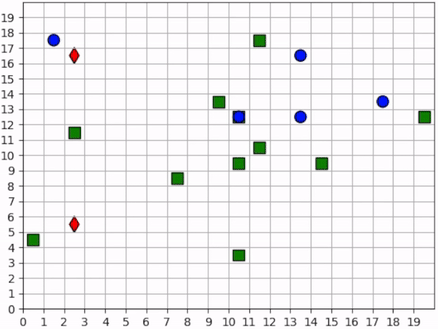

.. Admiral documentation highlights.

Admiral Highlights
==================


Emergent Collaborative and Competitive Behavior
-----------------------------------------------

In this experiment, we study how collaborative and competitive behaviors emerge
among agents in a partially observable stochastic game. In our simulation, each
agent occupies some grid square and can move around the map. Each agent can attack
agents that are on a different "team"; the attacked agent loses its life and
is removed from the simulation. Each agent can observe the state of the map in
a region surrounding its location. It can see other agents and what team they're
on as well as the edges of the map. The diagram below visuially depicts the agents'
observation and action spaces.

.. image:: .images/grid_agent_diagram.png
   :width: 100 %
   :alt: Diagram visually depicting agents' observation and action spaces.

In the various examples below, each policy is a two-layer MLP, with 64 unites in
each layer. We use RLlib's A2C Trainer with default parameters and train for
two million episodes on a compute node with 72 CPUs, a process that takes 3-4
hours per experiment.

Single Agent Foraging
`````````````````````
We start by considering a single foraging agent whose objective is to move around
the map collecting resources. The resources are technically agents themselves,
although they don't do anything and don't learn anything. The single foraging agent
can see up to three squares away, move up to one square away, and forage resources up
to one square away. The agent is rewarded for every resource it collects and given a small penalty
for attempting to move off the map and an even smaller "entropy" penalty every time-step to
encourage it to act quickly. At the beginning of every episode, the agent and resources spawn
at random locations in the map. Below is a video showing a typical full episode
of the learned behavior and a brief analysis.

.. figure:: .images/single_agent_full.gif
   :width: 100 %
   :alt: Video showing an episode with the trained behavior.

   A full episode showing what the forager learned. The forager is the blue circle
   and the resources are the green squares. Notice how the forager bounces among
   resource clusters, collecting all local resources before exploring the map for
   more.

When it can see resources
'''''''''''''''''''''''''
The agent moves toward the closest resource that it observes and forages it. Note
that the agent's foraging range is 1 square away from itself: the agent rarely
waits until it is directly over the resource before foraging it; it usually foraging
as soon as it is within range. In some cases, the agent intelligently places itself
in the middle of 2-3 resources in order to forage within the least number of moves.
When the resources are near the edge of the map, the agent behaves with some inefficiency,
likely due to the small penalty we give it for moving off the map, which results
in an aversion towards the map edges. Below is a series of short video
clips showing how the agent behaves when it can see resources.

.. figure:: .images/single_agent_exploit.gif
   :width: 100 %
   :alt: Video showing the forager's behavior when it observes resources.

   The forager learns an effective foraging strategy, moving towards and foraging
   the nearest resources that it observes.

When it cannot see resources
'''''''''''''''''''''''''''''
The foragers behavior when it is near resources is not surprising. But how does
the forager behaves when it cannot see any resources? The forager only sees that
which is near it and does not have any information distinguishing one "deserted"
area of the map from another. Recall, however, that the agent observe the edges
of the map, and it uses this information to learn an effecive exploration policy.
In the video below, we can see that the agent learns to explore the map by moving
along its edges in a clockwise-direction, occasionally making random moves towards
the middle of the map.


   The forager learns an effective exploration policy: it moves along the edge
   of the map in a clockwise direction.

.. IMPORTANT::
   We do not use any kind of heuristic or mixed policy. The exporation is behavior
   that *emerges* entirely from reinforcement learning.

Multiple Agents Foraging
````````````````````````
Having experimented with what a single forager can learn, we turn our attention
to the behaviors learned by multiple foragers interacting in the map at the same
time. Each forager is homogeneous with each other as described above: they can
all move up to one square away, observe up to three squares away, and are rewarded
the same way. The observations include other foragers in addition to the resources
and map edges. All agents train a single policy. Below is a brief analysis of the
learned behaviors.

Cover and explore
'''''''''''''''''
Our reward schema implicity encourages the agents to collaborate because we give
a small penalty to each agent for taking too long. Thus, the faster the agents
can collect all the resources, the less they are penalized. Furthermore, because each
agent trains the same policy, there is no incentive for competitive behavior. An
agent can afford to say, "I don't need to get the resource first. As long as one
of us gets it quickly, then we all benefit". Therefore, the foragers learn to spread
out to *cover* the space.

In the video clips below, we see that the foragers avoid being within observation
distance of one another. Typically, when two foragers get too close, they repel
each other, each moving in opposite directions, ensuring that the space is *covered*.
Furthermore, notice the dance-like exploration policy that these foragers learn.
Similar to the single-agent case above, the foragers learn to *explore* along the
edges of the map in a clockwise direction. However, they're not as efficient as
the single agent because they "repel" each other.

.. figure:: .images/multi_agent_spread.gif
   :width: 100 %
   :alt: Video showing how the foragers spread out.

   The foragers cover the map by spreading out and explore it by traveling in a
   clockwise direction.

.. IMPORTANT::
   We do not directly incentivize agents to keep their distance. No part of the
   reward schema directly deals with the agents' distances from each other. These
   learned behaviors are *emergent*.

Breaking the pattern
''''''''''''''''''''
When a forager observes a resource, it breaks its "cover and explore" behavior and
moves directly for the resource. Even multiple foragers move towards the same resource.
They have no reason to coordinate who will get it because, as we stated above,
there is no incentive for competition, so no need to negotiate. If another forager
gets there first, everyone benefits. The foragers learn to prioritize collecting
the resources over keeping their distance from each other.


   The foragers move towards resources to forage, even when there are other foragers
   nearby.

.. Tip::
   We should expect to see a mixture of these "behavioral regimes" occuring at
   the same time within a simulation because while some agents are "covering and
   exploring", others are moving towards resources.

Introducing Hunters
```````````````````
So far, we have seen intelligent behaviors emerge in both single- and multi-agent
scnearios. In the multiagent scenario, we even saw the emergence of collaborative
behavior. In the following experiments, we explore competitive emergence by introducing
hunters into the simulation. Like foragers, hunters can move up to one square away
and observe other agents and map edges up to three squares away. Hunters, however,
are more effective killers and can kill a forager up to two squares away. They are
rewarded for successful kills and penalized for bad moves and taking too long exactly
the same way as foragers.

While these agents may seem (almost) homogeneous, their resulting behaviors should
be very different. A forager who observes another forager should not be alarmed
and, as we saw above, can be repelled in order to "cover and explore"; but a hunter
who observes a forger should not be repelled but attracted. Therefore, because
we expect their behaviors to be different, we'll set up two policies. All the hunters
will train the same policy, and all the foragers will train the same policy, and
these policies will be distinct.

The leanred behaviors among the two groups in this mixed collaborate-competitive
simulation are tightly integrated, with multiple behavior patterns happening at
once within a simulation. Therefore, in contrast to above, we will not show video
clips that capture a single behavior type; instead, we will show video clips that
capture many interesting behaviors and attempt to describe them in detail.

First Scenario
''''''''''''''


Two of the foragers spawn next to hunters and are killed immediately. Afterwards,
two of the hunters do not observe any foragers for some time. They seem to have
learned the *cover* behavior by spreading out, but they don't seem to have
learned an effecient *explore* behavior since they mostly occupy the same region
of the map for the duration of the experiment.

The three foragers that remain at the bottom of the map. These foragers
work together to collect all nearby resources. Just as they finish the resource cluster,
a hunter moves within range and begins to chase them towards the bottom of the
map. When they hit the edge, they split in two directions. The hunter kills
one of them and then waits for one step, unsure about which forager to persue next.
After one step, we see that it decides to persue the forager to the right.

Meanwhile, the forager to the left continues to run away, straight into the path
of another hunter but also another resource. The forager could get away by running
to the right, but it decides to collect the resource at the cost of its own life.

The last remaining forager has escaped the hunter and has conveniently found another
cluster of resources, which it collects. A few frames later, it encounters the
same hunter, and this time it is chased all the way across the map. It manages
to evade the hunter and collect one final resource before encountering yet another
hunter. At the end, we see both hunters chasing the forager to the top of the map,
boxing it in and killing it.

Second scenario
'''''''''''''''



None of the foragers are under threat at the beginning of this scenario. They clear
a cluster of resources before one of them wanders into the path of a hunter. The
hunter gives chase, and the forager actually leads the hunter back to the group.
This works to its benefit, however, as the hunter is repeatedlyconfused by the
foragers exercising the *splitting* strategy. Meanwhile the second hunter has spotted
a forager and gives chase. The two hunters together are able to split up the pack
of foragers and systematically hunt them down. The last forager is chased into the
corner and killed.

.. NOTE::
   Humorously, the first forager that was spotted is the one who manages to stay
   alive the longest.
