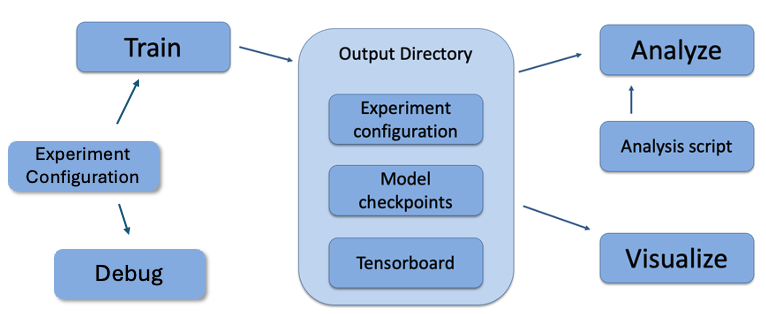

.. Admiral documentation overview.

Design
======

A reinforcement learning experiment in Admiral contains two interacting components:
a Simulation and a Trainer.

The Simulation contains agent(s) who can observe the state (or a substate) of the
Simulation and whose actions affect the state of the simulation. The simulation is
discrete in time, and at each time step agents can provide actions. The simulation
also produces rewards for each agent that the Trainer can use to train optimal behaviors.
The Agent-Simulation interaction produces state-action-reward tuples (SARs), which
can be collected in *rollout fragments* and used to optimize agent behaviors. 

The Trainer contains policies that map agents' observations to actions. Policies
are one-to-many with agents, meaning that there can be multiple agents using
the same policy. Policies may be heuristic (i.e. coded by the researcher) or trainable
by the RL algorithm.

In Admiral, the Simulation and Trainer are specified in a single Python configuration
file. Once these components are set up, they are passed as parameters to
RLlib's tune command, which will launch the RLlib application and begin the training
process. The training process will save checkpoints to an output directory,
from which the user can visualize and analyze results. The following diagram
demonstrates this workflow.



   Admiral's usage workflow. An experiment configuration is used to train agents'
   behaviors. The policies and environment are saved to an output directory. Behaviors can then
   be analyzed or visualized from the output directory.


Creating Agents and Environments
--------------------------------

Admiral provides three interfaces for setting up an agent-based simulation environment.

.. _overview_agent:

Agent
`````

.. ATTENTION::
   TODO: The link for Agent API is not very good because it is an organizational
   class that inherits from Observing and Acting Agent. We should come up with a
   better link/structure of the API.

First, we have :ref:`Agents <api_agent>`. An agent is an object with an observation and
action space. Many practitioners may be accustomed to gym.Env's interface, which
defines the observation and action space for the *environment*. However, in heterogeneous
multiagent settings, each *agent* can have different spaces; thus we assign these
spaces to the agents and not the environment.

An agent can be created like so:

.. code-block:: python

   from gym.spaces import Discrete, Box
   from admiral.envs import Agent
   agent = Agent(
       id='agent0',
       observation_space=Box(-1, 1, (2,)),
       action_space=Discrete(3)
   )

At this level, the Agent is basically a dataclass. We have left it open for our
users to extend its features as they see fit.

.. _abs:

Agent Based Simulation
``````````````````````
Next, we define an :ref:`Agent Based Simulation <api_abs>`, or ABS for short, with the
ususal ``reset`` and ``step``
functions that we are used to seeing in RL environments. These functions, however, do
not return anything; the state information must be obtained from the getters:
``get_obs``, ``get_reward``, ``get_done``, ``get_all_done``, and ``get_info``. The getters
take an agent's id as input and return the respective information from the simulation's
state. The ABS also contains a dictionary of agents that "live" in the environment.

An Agent Based Simulation can be created and used like so:

.. code-block:: python

   from admiral.envs import Agent, AgentBasedSimulation   
   class MySim(AgentBasedSimulation):
       def __init__(self, agents=None, **kwargs):
           self.agents = agents
        ... # Implement the ABS interface

   # Create a dictionary of agents
   agents = {f'agent{i}': Agent(id=f'agent{i}', ...) for i in range(10)}
   # Create the ABS environment with the agents
   env = MySim(agents=agents)
   env.reset()
   # Get the observations
   obs = {agent.id: env.get_obs(agent.id) for agent in agents.values()}
   # Take some random actions
   env.step({agent.id: agent.action_space.sample() for agent in agents.values()})
   # See the reward for agent3
   print(env.get_reward('agent3'))

.. IMPORTANT::
   Implementations of AgentBasedSimulation should call ``finalize`` at the
   end of its ``__init__``. Finalize ensures that all agents are configured and
   ready to be used for training.

.. NOTE::
   Instead of treating agents as dataclasses, we could have included the relevant
   information in the Agent Based Simulation with various dictionaries. For example,
   we could have ``action_spaces`` and ``observation_spaces`` that
   maps agents' ids to their action spaces and observation spaces, respectively.
   In Admiral, we favor the dataclass approach and use it throughout the package
   and documentation.

.. _sim-man:

Simulation Managers
```````````````````

The Agent Based Simulation interface does not specify an ordering for agents' interactions
with the environment. This is left open to give our users maximal flexibility. However,
in order to interace with RLlib's learning library, we provide a :ref:`Simulation Manager <api_sim>`
which specifies the output from ``reset`` and ``step`` as RLlib expects it. Specifically,

1. Agents that appear in the output dictionary will provide actions at the next step.
2. Agents that are done on this step will not provide actions on the next step.

Simulation managers are open-ended requiring only ``reset`` and ``step`` with output
described above. For convenience, we have provided two managers: :ref:`Turn Based <api_turn_based>`,
which implements turn-based games; and :ref:`All Step <api_all_step>`, which has every non-done
agent provide actions at each step.

Simluation Managers "wrap" environments, and they can be used like so:

.. code-block:: python

   from admiral.managers import AllStepManager
   from admiral.envs import AgentBasedSimulation, Agent
   class MySim(AgentBasedSimulation):
       ... # Define some simulation environment

   # Instatiate the environment
   env = MySim(agents=...)
   # Wrap the environment with the simulation manager
   sim = AllStepManager(env)
   # Get the observations for all agents
   obs = sim.reset()
   # Get simulation state for all non-done agents, regardless of which agents
   # actually contribute an action.
   obs, rewards, dones, infos = sim.step({'agent0': 4, 'agent2': [-1, 1]})


.. _external:

External Integration
````````````````````

In order to train agents in a Simulation Manager using RLlib, we must wrap the simulation
with either a :ref:`GymWrapper <api_gym_wrapper>` for single-agent simulations
(i.e. only a single entry in the `agents` dict) or a
:ref:`MultiAgentWrapper <api_ma_wrapper>` for multiagent simulations.


Training with an Experiment Configuration
-----------------------------------------
In order to run experiments, we must define a configuration file that
specifies Simulation and Trainer parameters. Here is the configuration file
from the :ref:`Corridor tutorial<tutorial_multi_corridor>` that demonstrates a
simple corridor environment with multiple agents.   

.. code-block:: python

   # Import the MultiCorridor ABS, a simulation manager, and the multiagent
   # wrapper needed to connect to RLlib's trainers
   from admiral.envs.corridor import MultiCorridor
   from admiral.managers import TurnBasedManager
   from admiral.external import MultiAgentWrapper
   
   # Create and wrap the environment
   # NOTE: The agents in `MultiCorridor` are all homogeneous, so this simulation
   # just creates and stores the agents itself.
   env = MultiAgentWrapper(AllStepManager(MultiCorridor()))
   
   # Register the environment with RLlib
   env_name = "MultiCorridor"
   from ray.tune.registry import register_env
   register_env(env_name, lambda env_config: env)
   
   # Set up the policies. In this experiment, all agents are homogeneous,
   # so we just use a single shared policy.
   ref_agent = env.unwrapped.agents['agent0']
   policies = {
       'corridor': (None, ref_agent.observation_space, ref_agent.action_space, {})
   }
   def policy_mapping_fn(agent_id):
       return 'corridor'
   
   # Experiment parameters
   params = {
       'experiment': {
           'title': f'{env_name}',
           'env_creator': lambda config=None: env,
       },
       'ray_tune': {
           'run_or_experiment': 'PG',
           'checkpoint_freq': 50,
           'checkpoint_at_end': True,
           'stop': {
               'episodes_total': 2000,
           },
           'verbose': 2,
           'config': {
               # --- Environment ---
               'env': env_name,
               'horizon': 200,
               'env_config': {},
               # --- Multiagent ---
               'multiagent': {
                   'policies': policies,
                   'policy_mapping_fn': policy_mapping_fn,
               },
               # --- Parallelism ---
               "num_workers": 7,
               "num_envs_per_worker": 1,
           },
       }
   }
   
.. NOTE::
   This example has ``num_workers`` set to 7 for a computer with 8 CPU's.
   You may need to adjust this for your computer to be `<cpu count> - 1`.

Experiment Parameters
`````````````````````
The strucutre of the parameters dictionary is very imporant. It *must* have an
`experiment` key which contains both the `title` of the experiment and the `env_creator`
function. This function should receive a config and, if appropriate, pass it to
the simulation constructor. In the example configuration above, we just retrun the
already-configured simulation. Without the title and environment creator, Admiral
may not behave as expected.

The experiment parameters also contains information that will be passed directly
to RLlib via the `ray_tune` parameter. See RLlib's documentation for a
`list of common configuration parameters <https://docs.ray.io/en/releases-1.2.0/rllib-training.html#common-parameters>`_.

Command Line
````````````
With the configuration file complete, we can utilize the command line interface
to train our agents. We simply type ``admiral train multi_corridor_example.py``,
where `multi_corridor_example.py` is the name of our configuration file. This will launch
Admiral, which will process the file and launch RLlib according to the
specified parameters. This particular example should take 1-10 minutes to
train, depending on your compute capabilities. You can view the performance
in real time in tensorboard with ``tensorboard --logdir ~/admiral_results``.


Visualizing
-----------
We can visualize the agents' learned behavior with the ``visualize`` command, which
takes as argument the output directory from the training session stored in
``~/admiral_results``. For example, the command

.. code-block::

   admiral visualize ~/admiral_results/MultiCorridor-2020-08-25_09-30/ -n 5 --record

will load the experiment (notice that the directory name is the experiment
title from the configuration file appended with a timestamp) and display an animation
of 5 episodes. The ``--record`` flag will save the animations as `.mp4` videos in
the training directory.


Analyzing
---------

The environment and trainer can also be loaded into a script for post-processing via the
``analyze`` command and custom subscripts. The subscript must implement the
following function:

.. code-block:: python

   # Load the environment and the trainer from the experiment as objects
   def run(env, agent):
       # Do whatever you want with the environment and the trained policies.
       ...

.. ATTENTION::
   Is it possible to add the subscript to the API?

Anaylsis can then be performed using the command line interface:

.. code-block::

   admiral analyze ~/admiral_results/MultiCorridor-2020-08-25_09-30/ my_analysis_script.py

See the :ref:`Predator Prey tutorial <tutorial_predator_prey>` for an example of
analyzing trained agent behavior.

Running at scale with HPC
-------------------------

Admiral also supports some functionality for training at scale. See the
:ref:`magpie tutorial <tutorial_magpie>`, which provides a walkthrough
for launching a training experiment on multiple compute nodes with slurm.


